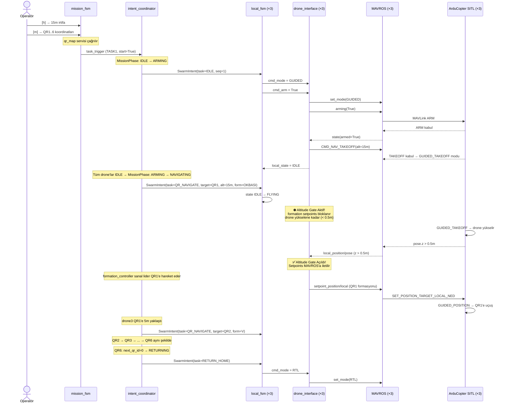
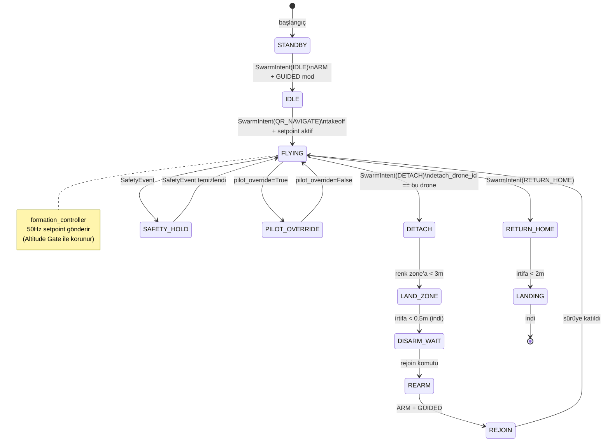
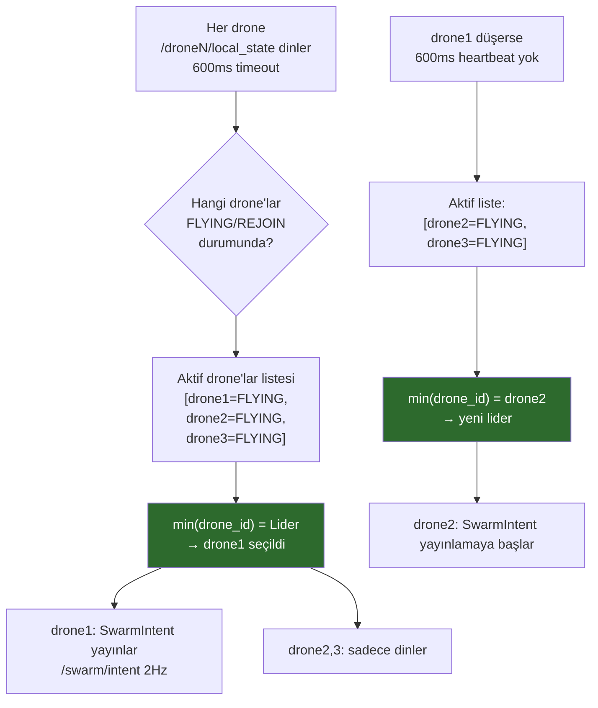

# TEKNOFEST 2026 — Swarm UAV Paketi

> **ROS2 Humble + ArduPilot SITL + Gazebo 8**
> 3 drone'lu dağıtık otonom sürü — QR navigasyon, formasyon kontrolü, hassas iniş

---

## İçindekiler

1. [Proje Genel Bakış](#1-proje-genel-bakış)
2. [Sistem Mimarisi](#2-sistem-mimarisi)
3. [Dizin Yapısı](#3-dizin-yapısı)
4. [TAM KURULUM REHBERİ — Sıfırdan Başlangıç](#4-tam-kurulum-rehberi--sıfırdan-başlangıç)
   - 4.1 Sistem Hazırlığı
   - 4.2 ROS2 Humble
   - 4.3 Gazebo 8
   - 4.4 ROS2–Gazebo Köprüsü
   - 4.5 MAVROS
   - 4.6 ArduPilot SITL
   - 4.7 ardupilot_gazebo Plugin
   - 4.8 Workspace ve Bu Repo
   - 4.9 ~/.bashrc Ayarları
   - 4.10 Kurulum Doğrulama
5. [Bileşenlerin Bağlantısı — Nasıl Çalışır?](#5-bileşenlerin-bağlantısı--nasıl-çalışır)
6. [Simülasyonu Başlatma](#6-simülasyonu-başlatma)
7. [Dashboard Kullanımı](#7-dashboard-kullanımı)
8. [Node'lar — Detaylı Açıklama](#8-nodelar--detaylı-açıklama)
9. [Topic ve Mesaj Haritası](#9-topic-ve-mesaj-haritası)
10. [Özel Mesajlar (swarm_msgs)](#10-özel-mesajlar-swarm_msgs)
11. [Görev Akışı (TASK1)](#11-görev-akışı-task1)
12. [Durum Makineleri](#12-durum-makineleri)
13. [Formasyon Tipleri](#13-formasyon-tipleri)
14. [QR Haritası (qr_map.yaml)](#14-qr-haritası-qr_mapyaml)
15. [Launch Konfigürasyonu](#15-launch-konfigürasyonu)
16. [Güvenlik ve Sınırlar](#16-güvenlik-ve-sınırlar)
17. [Sık Karşılaşılan Hatalar](#17-sık-karşılaşılan-hatalar)
18. [Bilinen Eksiklikler / Yapılacaklar](#18-bilinen-eksiklikler--yapılacaklar)
19. [Hızlı Başvuru Komutları](#19-hızlı-başvuru-komutları)
20. [Akış Şemaları (Mermaid)](#20-akış-şemaları-mermaid)

---

## 1. Proje Genel Bakış

Bu paket TEKNOFEST 2026 Sürü İHA yarışması için geliştirilmiştir. Üç ArduCopter drone'u:

- **Bully algoritmasıyla** lider seçer — lider düşerse 600ms içinde yeni lider seçilir
- **Lider 2 Hz SwarmIntent yayınlar** → tüm dronlar aynı komutu alır
- **QR waypoint rotasını** (QR1→2→3→4→5→6→HOME) takip eder
- QR kodlarından okunan formasyon tipine ve irtifaya uyum sağlar
- QR3'te bir drone ayrılarak renk bölgesine (RED/BLUE/GREEN) hassas iner
- GCS bağlantısı kesilse bile sürü otonom devam eder

```
Yarışma Günü Prosedürü:
  1. mission_fsm Dashboard aç
  2. [h] → jürinin söylediği irtifayı gir (örn: 15m)
  3. [m] → jürinin söylediği QR koordinatlarını gir
  4. [s] → 3 drone arm + kalkış + QR rotası başlar
  5. Gerekirse [a] → acil RTL (eve dön)
```

---

## 2. Sistem Mimarisi

```
                       ┌─────────────────────────────────────────┐
                       │          GCS (Yer İstasyonu)            │
                       │           mission_fsm.py                │
                       │  [s] start  [a] abort  [h] irtifa       │
                       │  [m] QR koordinat  [d] durum            │
                       └──────────────┬──────────────────────────┘
                                      │ /swarm/task_trigger
                                      │ /gcs/drone_altitude
                     ┌────────────────▼───────────────────────┐
                     │          SWARM (Her drone'da çalışır)   │
                     │                                         │
   /swarm/intent ←───┤  intent_coordinator  (Lider seçer)     │
   (SwarmIntent)     │  ↑ Bully: min(FLYING drone ID) = Lider │
                     └──────────────┬──────────────────────────┘
                                    │
          ┌────────────────┬─────────┴──────────────┐
          │                │                         │
   ┌──────▼──────┐  ┌──────▼──────┐         ┌──────▼──────┐
   │   drone1    │  │   drone2    │         │   drone3    │
   │             │  │             │         │             │
   │ local_fsm   │  │ local_fsm   │         │ local_fsm   │
   │ formation_  │  │ formation_  │         │ formation_  │
   │ controller  │  │ controller  │         │ controller  │
   │ collision_  │  │ collision_  │         │ collision_  │
   │ avoidance   │  │ avoidance   │         │ avoidance   │
   │ drone_iface │  │ drone_iface │         │ drone_iface │
   │ waypoint_   │  │ waypoint_   │         │ waypoint_   │
   │ navigator   │  │ navigator   │         │ navigator   │
   │ precision_  │  │ precision_  │         │ precision_  │
   │ landing     │  │ landing     │         │ landing     │
   │ safety_mon  │  │ safety_mon  │         │ safety_mon  │
   │             │  │             │         │ qr_percep.  │ ← kamera drone
   └──────┬──────┘  └──────┬──────┘         └──────┬──────┘
          │                │                         │
   ┌──────▼──────┐  ┌──────▼──────┐         ┌──────▼──────┐
   │  MAVROS     │  │  MAVROS     │         │  MAVROS     │
   │  UDP:14550  │  │  UDP:14560  │         │  UDP:14570  │
   └──────┬──────┘  └──────┬──────┘         └──────┬──────┘
          │                │                         │
   ┌──────▼──────┐  ┌──────▼──────┐         ┌──────▼──────┐
   │ ArduCopter  │  │ ArduCopter  │         │ ArduCopter  │
   │ SITL -I0    │  │ SITL -I1    │         │ SITL -I2    │
   │ JSON:9002   │  │ JSON:9012   │         │ JSON:9022   │
   └──────┬──────┘  └──────┬──────┘         └──────┬──────┘
          └────────────────┴──────────────────────┘
                                    │
                          ┌─────────▼─────────┐
                          │     Gazebo 8       │
                          │  ArduPilotPlugin   │
                          │  Drone1+2+3 model  │
                          │  QR Marker 1-6     │
                          └───────────────────┘
```

### Setpoint Zinciri

```
formation_controller
    ↓ /{ns}/setpoint_raw        (istenen pozisyon, 50 Hz)
collision_avoidance              (APF düzeltmesi eklenir)
    ↓ /{ns}/setpoint_final
drone_interface
    ↓ /{ns}/mavros/setpoint_position/local
MAVROS
    ↓ UDP MAVLink
ArduPilot SITL
    ↓ JSON fizik verisi
Gazebo 8 (görselleştirme + fizik motoru)
```

---

## 3. Dizin Yapısı

```
gz_ws/
└── src/
    ├── my_swarm_pkg/                  ← Ana paket (bu repo)
    │   ├── my_swarm_pkg/              ← Python node dosyaları
    │   │   ├── __init__.py
    │   │   ├── drone_interface.py     ← MAVROS köprüsü
    │   │   ├── local_fsm.py           ← Drone durum makinesi
    │   │   ├── intent_coordinator.py  ← Lider seçimi + görev koordinasyonu
    │   │   ├── formation_controller.py← Formasyon geometrisi
    │   │   ├── collision_avoidance.py ← APF çarpışma önleme
    │   │   ├── safety_monitor.py      ← Batarya + jeofence izleme
    │   │   ├── qr_perception.py       ← QR tespit (simülasyon: proximity)
    │   │   ├── waypoint_navigator.py  ← QR waypoint navigasyonu
    │   │   ├── precision_landing.py   ← Hassas iniş (renk zone)
    │   │   └── mission_fsm.py         ← GCS Dashboard
    │   ├── launch/
    │   │   └── swarm_competition.launch.py
    │   ├── config/
    │   │   ├── qr_map.yaml            ← QR waypoint haritası
    │   │   └── cyclonedds_localhost.xml
    │   ├── worlds/
    │   │   └── world_task1_qr_static.sdf
    │   ├── package.xml
    │   ├── setup.cfg
    │   └── setup.py
    ├── swarm_msgs/                    ← Özel ROS2 mesajları (bu repo)
    │   ├── msg/  (SwarmIntent, LocalState, QRResult, ...)
    │   └── srv/  (SetQRMap)
    ├── drone_control/                 ← Yardımcı test paketi (bu repo)
    └── ardupilot_gazebo/              ← Dış bağımlılık (ayrı kurulur)
        └── models/  (Drone1, Drone2, Drone3, qr_marker_1..6)
```

---

## 4. TAM KURULUM REHBERİ — Sıfırdan Başlangıç

> **Bu bölümü baştan sona sırayla uygula. Bir adımı atlama.**
> Tahmini toplam kurulum süresi: ~2-3 saat (indirme hızına bağlı)

### 4.1 Sistem Hazırlığı

```bash
# Ubuntu 22.04 LTS olduğunu doğrula
lsb_release -a
# "Ubuntu 22.04" görmeli

# Sistemi güncelle
sudo apt update && sudo apt upgrade -y

# Temel araçları kur
sudo apt install -y \
  git curl wget nano build-essential \
  python3-pip python3-dev \
  software-properties-common \
  xterm  # Dashboard penceresi için gerekli
```

---

### 4.2 ROS2 Humble Kurulumu

```bash
# Locale ayarla
sudo apt install -y locales
sudo locale-gen en_US en_US.UTF-8
sudo update-locale LC_ALL=en_US.UTF-8 LANG=en_US.UTF-8
export LANG=en_US.UTF-8

# ROS2 GPG anahtarını ekle
sudo curl -sSL https://raw.githubusercontent.com/ros/rosdistro/master/ros.key \
  -o /usr/share/keyrings/ros-archive-keyring.gpg

# ROS2 apt reposunu ekle
echo "deb [arch=$(dpkg --print-architecture) signed-by=/usr/share/keyrings/ros-archive-keyring.gpg] \
  http://packages.ros.org/ros2/ubuntu $(. /etc/os-release && echo $UBUNTU_CODENAME) main" \
  | sudo tee /etc/apt/sources.list.d/ros2.list > /dev/null

# ROS2 Humble Desktop tam kurulum
sudo apt update
sudo apt install -y ros-humble-desktop

# Geliştirme araçları
sudo apt install -y \
  python3-colcon-common-extensions \
  python3-rosdep \
  python3-vcstool \
  ros-humble-rclpy \
  ros-humble-std-msgs \
  ros-humble-geometry-msgs \
  ros-humble-sensor-msgs

# rosdep başlat (bir kez çalıştır)
sudo rosdep init
rosdep update

# ROS2'yi aktif et
source /opt/ros/humble/setup.bash

# Kurulumu test et
ros2 --version
# Çıktı: "ros2 1.3.x" veya benzeri bir versiyon görmeli
```

---

### 4.3 Gazebo 8 (Harmonic) Kurulumu

```bash
# Gazebo GPG anahtarını ekle
sudo curl https://packages.osrfoundation.org/gazebo.gpg \
  --output /usr/share/keyrings/pkgs-osrf-archive-keyring.gpg

# Gazebo apt reposunu ekle
echo "deb [arch=$(dpkg --print-architecture) signed-by=/usr/share/keyrings/pkgs-osrf-archive-keyring.gpg] \
  http://packages.osrfoundation.org/gazebo/ubuntu-stable $(lsb_release -cs) main" \
  | sudo tee /etc/apt/sources.list.d/gazebo-stable.list > /dev/null

sudo apt update
sudo apt install -y gz-harmonic

# Kurulumu test et:
gz sim --version
# Çıktı: "8.x.x" görmeli

# Test: Boş dünya aç (Ctrl+C ile kapat)
gz sim empty.sdf
```

---

### 4.4 ROS2–Gazebo Köprüsü

```bash
# ros_gz paketi (ROS2 ↔ Gazebo iletişimi için)
sudo apt install -y \
  ros-humble-ros-gz \
  ros-humble-ros-gz-bridge \
  ros-humble-ros-gz-sim

# Kurulumu test et:
source /opt/ros/humble/setup.bash
ros2 pkg list | grep ros_gz
# "ros_gz_bridge", "ros_gz_sim" görmeli
```

---

### 4.5 MAVROS Kurulumu

MAVROS, ArduPilot ile ROS2 arasındaki MAVLink köprüsüdür. Her drone için ayrı bir MAVROS instance çalışır.

```bash
# MAVROS ve ek paketleri kur
sudo apt install -y \
  ros-humble-mavros \
  ros-humble-mavros-extras \
  ros-humble-mavros-msgs

# GeographicLib veri dosyalarını indir (ZORUNLU — atlarsan MAVROS başlamaz)
sudo /opt/ros/humble/lib/mavros/install_geographiclib_datasets.sh
# Bu işlem birkaç dakika sürer, internetten ~75MB indirir

# Kurulumu test et:
source /opt/ros/humble/setup.bash
ros2 pkg list | grep mavros
# "mavros", "mavros_extras", "mavros_msgs" görmeli
```

**MAVROS Nasıl Çalışır:**
```
ArduPilot SITL (UDP 14550) ←→ MAVROS ←→ ROS2 topic'leri
                                          /drone1/mavros/local_position/pose
                                          /drone1/mavros/state
                                          /drone1/mavros/setpoint_position/local
                                          ...
```

---

### 4.6 ArduPilot SITL Derleme

SITL (Software In The Loop), gerçek donanım olmadan ArduCopter'ı simüle eder.

```bash
# ArduPilot kaynak kodunu indir
cd ~
git clone https://github.com/ArduPilot/ardupilot.git --recurse-submodules
cd ardupilot

# Git submodule'lerin hepsini çek (eksikse sorun olur)
git submodule update --init --recursive

# Ubuntu bağımlılıklarını kur (ArduPilot'un kendi scripti)
Tools/environment_install/install-prereqs-ubuntu.sh -y

# Terminali kapat ve yeniden aç (ya da):
. ~/.profile

# ArduCopter binary'yi derle (15-30 dakika sürebilir!)
cd ~/ardupilot
./waf configure --board sitl
./waf copter

# Derleme başarılı mı kontrol et:
ls ~/ardupilot/build/sitl/bin/arducopter
# Bu dosya varsa başarılı

~/ardupilot/build/sitl/bin/arducopter --version
# ArduCopter versiyon bilgisi görmeli

# Varsayılan parametre dosyası:
ls ~/ardupilot/Tools/autotest/default_params/copter.parm
# Bu dosya da olmalı
```

**SITL Nasıl Çalışır:**
```
arducopter binary
  --model json          ← Gazebo'ya JSON formatında fizik verisi gönderir
  -I0                   ← Instance 0 (drone1), -I1 drone2, -I2 drone3
  --sysid 1             ← MAVLink sistem ID'si
  --home lat,lon,alt,heading  ← Başlangıç koordinatları

UDP bağlantıları:
  9002 ← Gazebo JSON fizik motoru (gelen sensor data)
  14550 → MAVROS (MAVLink, giden komutlar)
```

---

### 4.7 ardupilot_gazebo Plugin Kurulumu

Bu plugin, Gazebo ile ArduPilot SITL arasındaki JSON köprüsüdür. Drone modelleri ve QR marker modelleri de burada.

```bash
# Workspace'e kur
mkdir -p ~/gz_ws/src
cd ~/gz_ws/src

git clone https://github.com/ArduPilot/ardupilot_gazebo.git

# Build için gerekli paketler
sudo apt install -y \
  libgz-sim8-dev \
  rapidjson-dev \
  libopencv-dev

# Build et
cd ~/gz_ws
source /opt/ros/humble/setup.bash
colcon build --packages-select ardupilot_gazebo

# Kurulumu test et:
ls ~/gz_ws/install/ardupilot_gazebo/lib/
# "libArduPilotPlugin.so" veya benzeri .so dosyası görmeli

ls ~/gz_ws/src/ardupilot_gazebo/models/
# Drone1/, Drone2/, Drone3/ ve qr_marker_1/ ... qr_marker_6/ görmeli
```

**ardupilot_gazebo Plugin Nasıl Çalışır:**
```
Gazebo 8
  ↓ world SDF dosyasını okur
  ↓ her Drone modelinin SDF'inde <plugin name="ArduPilotPlugin"> bulur
  ↓ Plugin UDP 9002/9012/9022'den ArduCopter'a fizik verisi gönderir
  ↓ ArduCopter motor komutlarını alır → Gazebo'da drone uçar
```

---

### 4.8 Workspace ve Bu Repo

```bash
# Workspace src klasörüne git
cd ~/gz_ws/src

# Bu repoyu clone'la
git clone https://github.com/SeydaGulKOCAK/eren-takim-reposu.git .
# ÖNEMLİ: Sondaki nokta (.) mevcut klasöre clone'lar

# Kontrol et — şu paketler görünmeli:
ls ~/gz_ws/src/
# ardupilot_gazebo/  drone_control/  my_swarm_pkg/  swarm_msgs/

# Bağımlılıkları otomatik çek
cd ~/gz_ws
rosdep install --from-paths src --ignore-src -r -y

# Tüm paketi build et
colcon build

# Build başarılı mı?
echo $?   # 0 görürsen başarılı

# Executable'ların doğru yerde olduğunu kontrol et:
ls ~/gz_ws/install/my_swarm_pkg/lib/my_swarm_pkg/
# mission_fsm, drone_interface, local_fsm, intent_coordinator,
# formation_controller, collision_avoidance, safety_monitor,
# qr_perception, waypoint_navigator, precision_landing
# → Hepsi görünmeli

# Workspace'i aktif et
source ~/gz_ws/install/setup.bash
```

---

### 4.9 ~/.bashrc Ayarları

Bu satırları `~/.bashrc` dosyasının en altına ekle. Her terminal açıldığında otomatik yüklenir.

```bash
# Editörle aç:
nano ~/.bashrc
# En alta yapıştır:

# ─── ROS2 Humble ───
source /opt/ros/humble/setup.bash

# ─── Workspace ───
source ~/gz_ws/install/setup.bash

# ─── Gazebo Model Yolları ───
# (Drone1-3 ve qr_marker_1-6 modellerinin bulunduğu klasörler)
export GZ_SIM_RESOURCE_PATH="\
$HOME/gz_ws/src/my_swarm_pkg/models:\
$HOME/gz_ws/src/ardupilot_gazebo/models:\
$HOME/gz_ws/install/ardupilot_gazebo/share/ardupilot_gazebo/models:\
$HOME/ardupilot_gazebo/models:\
/usr/share/gz/gz-sim8/models"

# ─── Gazebo Plugin Yolu (ardupilot_gazebo plugin .so dosyası) ───
export GZ_SIM_SYSTEM_PLUGIN_PATH="$HOME/gz_ws/install/ardupilot_gazebo/lib:$GZ_SIM_SYSTEM_PLUGIN_PATH"

# ─── ROS2 DDS (tek makinede localhost iletişimi) ───
export ROS_LOCALHOST_ONLY=1
export CYCLONEDDS_URI=file://$HOME/gz_ws/src/my_swarm_pkg/config/cyclonedds_localhost.xml

# ─── Ekran (SITL xterm penceresi için) ───
export DISPLAY=:0
```

Kaydedip çıktıktan sonra:
```bash
source ~/.bashrc
```

---

### 4.10 Kurulum Doğrulama

Her şeyin çalıştığını adım adım kontrol et:

```bash
# 1. ROS2
ros2 --version
# → "ros2 1.3.x" görmeli

# 2. Gazebo
gz sim --version
# → "8.x.x" görmeli

# 3. MAVROS
source /opt/ros/humble/setup.bash
ros2 pkg list | grep mavros
# → mavros, mavros_extras, mavros_msgs görmeli

# 4. ArduCopter SITL binary
~/ardupilot/build/sitl/bin/arducopter --version
# → ArduCopter versiyon bilgisi görmeli

# 5. ardupilot_gazebo modelleri
ls ~/gz_ws/src/ardupilot_gazebo/models/ | grep -E "Drone|qr_marker"
# → Drone1 Drone2 Drone3 qr_marker_1 ... qr_marker_6 görmeli

# 6. Swarm paketleri
ros2 pkg list | grep -E "my_swarm|swarm_msgs"
# → my_swarm_pkg, swarm_msgs görmeli

# 7. Executable'lar
ls ~/gz_ws/install/my_swarm_pkg/lib/my_swarm_pkg/ | wc -l
# → En az 10 dosya görmeli

echo "=== Tüm kontroller tamam! Simülasyonu başlatabilirsin. ==="
```

---

### Sadece my_swarm_pkg Değiştiyse

```bash
cd ~/gz_ws
colcon build --packages-select my_swarm_pkg
source install/setup.bash
```

### Tüm Workspace Rebuild

```bash
cd ~/gz_ws
colcon build
source install/setup.bash
```

---

## 5. Bileşenlerin Bağlantısı — Nasıl Çalışır?

Bu bölüm, başlatma sonrasında hangi bileşenin neyle nasıl konuştuğunu açıklar.

### 5.1 ArduPilot SITL ↔ Gazebo Bağlantısı

```
Launch dosyası 3 adet arducopter process başlatır:

  arducopter -I0 --model json --home -35.363262,149.165237,584,0
      ↕ UDP 127.0.0.1:9002  (JSON formatında fizik verisi)
  Gazebo → world_task1_qr_static.sdf → Drone1 modeli → ArduPilotPlugin

  arducopter -I1 --model json --home -35.363262,149.165237,584,0
      ↕ UDP 127.0.0.1:9012
  Gazebo → Drone2 modeli → ArduPilotPlugin

  arducopter -I2 --model json --home -35.363262,149.165237,584,0
      ↕ UDP 127.0.0.1:9022
  Gazebo → Drone3 modeli → ArduPilotPlugin
```

JSON verisi şunları içerir: pozisyon, hız, ivme, jiroskop, barometrik basınç, GPS → ArduCopter bunları sensor verisi olarak kullanır, PID kontrolcüsü motor komutları üretir → Gazebo motoru döndürür → drone uçar.

### 5.2 ArduPilot SITL ↔ MAVROS Bağlantısı

```
arducopter -I0  →  TCP 5760 / UDP 14550
                         ↕ MAVLink protokolü
                   MAVROS (drone1, fcu_url=udp://:14550@127.0.0.1:14551)
                         ↕ ROS2 topic'leri
                   /drone1/mavros/local_position/pose  (konum)
                   /drone1/mavros/state               (arm/mod durumu)
                   /drone1/mavros/setpoint_position/local (hedef pozisyon)
                   /drone1/mavros/cmd/arming           (arm servisi)
                   /drone1/mavros/set_mode             (mod değiştirme)
```

Her drone için farklı port: drone1=14550, drone2=14560, drone3=14570.

### 5.3 MAVROS ↔ Swarm Node'ları Bağlantısı

```
drone_interface.py
  ← MAVROS'tan OKUR:
    /drone1/mavros/local_position/pose   → /{ns}/pose olarak yayınlar
    /drone1/mavros/local_position/velocity_local → /{ns}/velocity
    /drone1/mavros/state                 → arm/mod takibi

  → MAVROS'A YAZAR:
    /drone1/mavros/setpoint_position/local  ← /{ns}/setpoint_final
    /drone1/mavros/cmd/arming               ← /{ns}/cmd_arm
    /drone1/mavros/set_mode                 ← /{ns}/cmd_mode
```

### 5.4 Swarm Node'ları Arası İletişim

```
intent_coordinator (lider)
    → /swarm/intent (SwarmIntent, 2 Hz)
         ↓
    local_fsm (her drone'da)
         ↓ durum değişince
    /{ns}/cmd_arm, /{ns}/cmd_mode
         ↓
    drone_interface → MAVROS → ArduPilot

formation_controller
    → /{ns}/setpoint_raw
         ↓
    collision_avoidance (APF düzeltmesi)
         ↓
    /{ns}/setpoint_final
         ↓
    drone_interface → MAVROS → ArduPilot
```

---

## 6. Simülasyonu Başlatma

### Ön Koşul
`~/.bashrc` ayarları yapılmış ve `source ~/.bashrc` çalıştırılmış olmalı.

### Başlatma Komutu

```bash
cd ~/gz_ws
source install/setup.bash
DISPLAY=:0 ros2 launch my_swarm_pkg swarm_competition.launch.py
```

**Ne açılır:**

| Pencere | Açıklama |
|---|---|
| Gazebo | Drone1-3 ve QR Marker 1-6 modelleri |
| Mission FSM Dashboard | Komut girilen xterm penceresi |
| Arka planda | 3× ArduCopter SITL, 3× MAVROS, tüm swarm node'ları |

**Başlangıç sırası:**

| Zaman | Olay |
|---|---|
| 0s | Gazebo başlar |
| 0s | ArduCopter drone1 başlar |
| 2s | ArduCopter drone2 başlar |
| 4s | ArduCopter drone3 başlar |
| 9.0s | drone1 node'ları başlar |
| 9.5s | drone2 node'ları başlar |
| 10.0s | drone3 node'ları başlar |
| 10.5s | qr_perception başlar |
| 10.7s | Mission FSM Dashboard açılır |
| 12s | MAVROS drone1 başlar (ArduCopter HEARTBEAT için beklenir) |
| 14s | MAVROS drone2 başlar |
| 16s | MAVROS drone3 başlar |

> **Not:** MAVROS'lar kasıtlı olarak geç başlar. ArduCopter SITL tam ayağa kalkmadan MAVROS bağlanırsa bağlantı kopuklukları yaşanıyordu.

**Başarılı başlangıç logları (terminalde şunları görmeli):**

```
[qr_perception] ✅ QR haritası HAZIR sinyali gönderildi (YAML startup)
[safety_monitor] ⚡ [drone1] Batarya: %99.x
[intent_coordinator] [drone1] QR map ön-yüklendi: 6 düğüm
```

---

## 7. Dashboard Kullanımı

Dashboard `xterm` penceresinde açılır. **Sadece klavye ile** çalışır — fare çalışmaz.

### Komut Tablosu

| Tuş | Açıklama |
|---|---|
| `h` | **İrtifa gir** — jüri yarışmada söyler (2–100m arası) |
| `m` | **QR koordinatları gir** — jüri yarışmada söyler |
| `s` | **Görevi başlat** — 3 drone ARM + kalkış + QR rotası |
| `a` | **ACİL DURDUR** — tüm dronlar RTL (eve döner) |
| `d` | Durum ekranını yenile |
| `q` | Dashboard'ı kapat |
| Enter | Ekranı yenile |

### Yarışma Günü Sırası

```
1. Dashboard penceresi açılmasını bekle (~11 saniye)

2. Jüri irtifayı söylediğinde:
   h → Enter → 15 → Enter
   (15m yerine jürinin söylediği değeri yaz)

3. Jüri QR koordinatlarını söylediğinde:
   m → Enter
   QR1: 10 5 0   (x y z formatında, Enter ile geç)
   QR2: 10 -5 0
   QR3: 15 0 0
   ... (6 QR koordinatı)

4. Jüri "başla" komutunu verince:
   s → Enter

5. Drone'lar sırayla ARM olur, kalkar, QR1'e uçar.

6. Gerekirse acil durdurmak için:
   a → Enter
```

### [m] QR Koordinat Girişi Detayı

```
m tuşuna bas → ekranda "QR1:" görünür
10 5 0   ← "x y z" formatında yaz (metre cinsinden, ENU koordinatları)
Enter    ← bir sonraki QR'a geç
10 -5 0  ← QR2
Enter
... (6 QR için tekrarla)
Enter    ← son QR'dan sonra onaylar ve servise gönderir
```

---

## 8. Node'lar — Detaylı Açıklama

### 8.1 `drone_interface.py`

**Görev:** MAVROS ↔ Swarm ROS2 köprüsü.

| MAVROS → | ROS2 Topic | Tip | Açıklama |
|---|---|---|---|
| `/{ns}/mavros/local_position/pose` | `/{ns}/pose` | PoseStamped | Konum (ENU, 20 Hz) |
| `/{ns}/mavros/local_position/velocity_local` | `/{ns}/velocity` | TwistStamped | Hız |
| `/{ns}/mavros/state` | — | State | Arm/mod takibi |

| ROS2 → | MAVROS Hedef | Açıklama |
|---|---|---|
| `/{ns}/setpoint_final` | `/{ns}/mavros/setpoint_position/local` | Son setpoint |
| `/{ns}/landing_target` | `/{ns}/mavros/setpoint_position/local` | Precision landing override |
| `/{ns}/cmd_mode` | `/{ns}/mavros/set_mode` | GUIDED/LAND/RTL/BRAKE |
| `/{ns}/cmd_arm` | `/{ns}/mavros/cmd/arming` | ARM/DISARM |

---

### 8.2 `local_fsm.py`

**Görev:** Her drone'un durum makinesi. SwarmIntent'i işler, drone_interface'e komut gönderir.

**Çift Filtre (eski lider paketlerini engeller):**
- `seq <= son_görülen_seq` → DROP
- `timestamp < son_görülen_timestamp (aynı seq'de)` → DROP

---

### 8.3 `intent_coordinator.py`

**Görev:** Sürünün ne yapacağına karar verir. Her drone'da çalışır, sadece lider `/swarm/intent` yazar.

**Lider Seçimi (Bully):**
- Tüm drone'lar `/drone{i}/local_state` dinler (600ms heartbeat timeout)
- FLYING/REJOIN drone'lar arasından `min(drone_id)` = lider
- Tüm drone'lar aynı hesaplamayı yapar → merkezi koordinasyon gerekmez

**MissionPhase akışı:**
```
IDLE → ARMING → NAVIGATING → AT_QR → DETACHING → REJOINING → RETURNING → COMPLETE
```

---

### 8.4 `formation_controller.py`

**Görev:** Sanal yapı ile formasyon geometrisi. `/{ns}/setpoint_raw` yayınlar.

- Sanal lider 3 m/s hızla hedefe gider, tüm dronlar aynı sanal lideri takip eder
- Slew rate limiting: 0.10 m/adım @ 50 Hz
- Kontrol döngüsü: **50 Hz**

---

### 8.5 `collision_avoidance.py`

**Görev:** APF (Yapay Potansiyel Alan) ile çarpışma önleme.

```
F_j = K_REP * (1/d - 1/R_MAX) / d²   [d < R_MAX ise]
setpoint_final = setpoint_raw + clip(ΣF_j, 3.0m)
```

| Parametre | Değer |
|---|---|
| R_MAX | 8.0 m |
| R_MIN | 3.0 m |
| K_REP | 18.0 |
| TTC Threshold | 1.5 s |

---

### 8.6 `safety_monitor.py`

**Görev:** Batarya, jeofence ve heartbeat izleme.

- Batarya %15 altı → `SafetyEvent(BATTERY_CRITICAL)`
- Jeofence ihlali → `SafetyEvent(GEOFENCE_BREACH)`
- İzleme döngüsü: **5 Hz**

---

### 8.7 `qr_perception.py`

**Görev:** QR tespit simülasyonu.

> **ÖNEMLİ:** Simülasyonda proximity-based (mesafeye dayalı) tespit kullanılıyor.
> Gerçek donanımda bu modülün OpenCV + kamera topic kullanacak şekilde değiştirilmesi gerekiyor.
> Bkz. Bölüm 18 — Bilinen Eksiklikler #1.

- drone3 QR marker'a 5m yaklaşınca → YAML'dan QR içeriğini okuyarak `QRResult` yayınlar
- Startup'ta YAML yüklenir → 2 saniye sonra `qr_map_ready=True` sinyali gönderilir

---

### 8.8 `waypoint_navigator.py`

**Görev:** QR waypoint navigasyonunu yönetir. Sadece lider drone'da aktif.

- Hedefe 5m yaklaşınca loiter başlar
- QR sonucunu bekler (varsayılan 3s)
- Loiter bitti → sonraki QR'a geçer

---

### 8.9 `precision_landing.py`

**Görev:** DETACH drone'unu renk zone'una hassas indirir.

1. `intent.zone_color` oku (RED/BLUE/GREEN)
2. `/perception/color_zones`'dan zone konumunu bul
3. `/{ns}/landing_target = (zone_x, zone_y, 5.0m)` @ 10 Hz yayınla
4. XY hata < 0.8m → hizalandı
5. `local_fsm` LAND komutu verir

---

### 8.10 `mission_fsm.py`

**Görev:** GCS arayüzü. Görev başlatma/durdurma + durum izleme.

Yayınladığı topic'ler:

| Topic | Tip | Açıklama |
|---|---|---|
| `/swarm/task_trigger` | TaskTrigger | Görev başlat/durdur |
| `/swarm/gcs_heartbeat` | String | GCS aktiflik (2 Hz) |
| `/gcs/drone_altitude` | Float64 | Jüri irtifası |

---

## 9. Topic ve Mesaj Haritası

```
SWARM BÜS (tüm drone'lar dinler/yazar):
  /swarm/intent           SwarmIntent    ← Lider (2 Hz)
  /swarm/leader_id        UInt8          ← Lider (5 Hz)
  /swarm/gcs_heartbeat    String         ← mission_fsm (2 Hz)
  /swarm/task_trigger     TaskTrigger    ← mission_fsm
  /swarm/qr_map_ready     Bool           ← qr_perception
  /swarm/loiter_cmd       Bool           ← waypoint_navigator
  /swarm/join_request     JoinRequest    ← STANDBY dronlar
  /swarm/virtual_leader   PoseStamped    ← formation_controller (lider)
  /safety/event           SafetyEvent    ← safety_monitor, collision_avoidance
  /qr/result              QRResult       ← qr_perception
  /perception/color_zones ColorZoneList  ← qr_perception (1 Hz)
  /gcs/drone_altitude     Float64        ← mission_fsm

PER-DRONE (ns = drone1 / drone2 / drone3):
  /{ns}/pose              PoseStamped    ← drone_interface (20 Hz)
  /{ns}/velocity          TwistStamped   ← drone_interface
  /{ns}/local_state       LocalState     ← local_fsm (10 Hz)
  /{ns}/pilot_override    Bool           ← drone_interface
  /{ns}/setpoint_raw      PoseStamped    ← formation_controller (50 Hz)
  /{ns}/setpoint_final    PoseStamped    ← collision_avoidance (50 Hz)
  /{ns}/landing_target    PoseStamped    ← precision_landing (10 Hz)
  /{ns}/cmd_mode          String         ← local_fsm
  /{ns}/cmd_arm           Bool           ← local_fsm
```

---

## 10. Özel Mesajlar (swarm_msgs)

### SwarmIntent.msg
```
std_msgs/Header header
uint32  seq                  # Monoton artan (çift filtre için kritik)
uint8   leader_id            # Yayınlayan drone ID
string  task_id              # IDLE | QR_NAVIGATE | MANEUVER | DETACH | REJOIN | RETURN_HOME
string  formation_type       # OKBASI | V | CIZGI
float32 drone_spacing        # metre
float32 target_yaw           # radian, ENU (x-east = 0)
geometry_msgs/Point target_pos
float32 drone_altitude       # uçuş irtifası (m)
uint8   detach_drone_id      # ayrılacak drone (0 = yok)
string  zone_color           # RED | BLUE | GREEN
bool    maneuver_active
float32 maneuver_pitch_deg
float32 maneuver_roll_deg
uint8   active_drone_count
uint8   join_drone_id
uint32  qr_seq
builtin_interfaces/Time wait_until
```

### LocalState.msg
```
std_msgs/Header header
uint8  drone_id
string state   # STANDBY | IDLE | FLYING | DETACH | LAND_ZONE |
               # DISARM_WAIT | REARM | REJOIN | RETURN_HOME |
               # LANDING | SAFETY_HOLD | PILOT_OVERRIDE
uint32 seq
```

### QRResult.msg
```
std_msgs/Header header
string  team_id
uint32  qr_id
bool    formation_active
string  formation_type
float32 drone_spacing
bool    altitude_active
float32 altitude
bool    maneuver_active
float32 pitch_deg
float32 roll_deg
bool    detach_active
uint8   detach_drone_id
string  zone_color
uint32  next_qr_id        # 0 = son QR, eve dön
geometry_msgs/Point qr_position
geometry_msgs/Point next_qr_position
float32 wait_seconds
```

### TaskTrigger.msg
```
std_msgs/Header header
string task_type   # TASK1 | TASK2
bool   start       # True = başlat, False = durdur
string team_id
```

### SetQRMap.srv
```
# Request:
geometry_msgs/Point[] qr_positions
uint32[]              qr_ids
uint32[]              next_qr_ids
---
# Response:
bool   success
string message
```

---

## 11. Görev Akışı (TASK1)

```
[Operatör]               [intent_coordinator]       [local_fsm]
    │                           │                         │
    ├─[h] 15m irtifa──────────→ │ _drone_altitude=15      │
    │                           │                         │
    ├─[m] QR koordinatları────→ qr_perception             │
    │                           │ ← qr_map_ready=True     │
    │                           │                         │
    ├─[s] START ─────────────→ │ _mission_phase=ARMING   │
    │                           │                         │
    │                           ├──IDLE intent───────────→│ STANDBY→IDLE
    │                           │                         │ ARM + GUIDED
    │                           │    ←─local_state(IDLE)──│
    │                           │                         │
    │                           ├──QR_NAVIGATE intent────→│ IDLE→FLYING
    │                           │  target=QR1, alt=15m    │ setpoint aktif
    │                           │  formation=OKBASI        │
    │                           │                         │
    │                    (drone3 QR1'e 5m yaklaştı)       │
    │                           │ ← QRResult(qr_id=1,     │
    │                           │   next=QR2, form=V)     │
    │                           ├──QR_NAVIGATE intent────→│
    │                           │  target=QR2, form=V     │
    │                           │                         │
    │                    (QR2, QR3 aynı şekilde...)       │
    │                           │                         │
    │                    (QR3: detach komutu)             │
    │                           ├──DETACH intent─────────→│ (drone2)
    │                           │  detach_id=2, RED       │ FLYING→DETACH
    │                           │                         │
    │                    (precision_landing drone2'yi RED zone'a götürür)
    │                           │                         │
    │                    (QR4, QR5, QR6...)               │
    │                           │                         │
    │                    (QR6: next_qr_id=0 → eve dön)   │
    │                           ├──RETURN_HOME intent────→│ →LANDING
    [Görev Tamamlandı]
```

---

## 12. Durum Makineleri

### LocalState (local_fsm)

```
                ┌─────────────┐
                │   STANDBY   │ ← başlangıç
                └──────┬──────┘
                       │ IDLE intent (arm)
                ┌──────▼──────┐
                │    IDLE     │ ← armed, GUIDED mod
                └──────┬──────┘
                       │ QR_NAVIGATE intent
                ┌──────▼──────┐
                │   FLYING    │ ◄──────────────────┐
                └──────┬──────┘                    │
                 DETACH│intent                     │ REJOIN
                ┌──────▼──────┐             ┌──────┴──────┐
                │   DETACH    │             │   REJOIN    │
                └──────┬──────┘             └──────┬──────┘
               zone<3m │               arm+GUIDED  │
                ┌──────▼──────┐             ┌──────┴──────┐
                │  LAND_ZONE  │             │    REARM    │
                └──────┬──────┘             └─────────────┘
                alt<0.5│
                ┌──────▼──────┐
                │ DISARM_WAIT │
                └─────────────┘

[Herhangi bir state'den:]
  SafetyEvent     → SAFETY_HOLD
  pilot_override  → PILOT_OVERRIDE
  RETURN_HOME intent → RETURN_HOME → LANDING
```

### MissionPhase (intent_coordinator)

```
IDLE → (task_trigger) → ARMING → (tüm drone IDLE) → NAVIGATING
     ↓                                                    ↓
  (abort)                                           (QR yaklaştı)
     ↓                                                    ↓
  IDLE ←──────────────────────────────────────── AT_QR
                                                    ↓ (detach komutu)
                                               DETACHING
                                                    ↓
                                               REJOINING
                                                    ↓ (tüm QR bitti)
                                               RETURNING → COMPLETE
```

---

## 13. Formasyon Tipleri

### OKBASI
```
       ● rank-0  (en küçük ID, önde)
      / \
 rank-1  rank-2

Offsetler (spacing=1m):
  rank-0: (+2/3,  0)   ← önde ortada
  rank-1: (-1/3, -½)   ← arkada sol
  rank-2: (-1/3, +½)   ← arkada sağ
```

### V-Formation
```
       ● rank-0
      /         \
 rank-1         rank-2

Offsetler (spacing=1m):
  rank-0: (+2/3,  0)
  rank-1: (-1/3, -1)
  rank-2: (-1/3, +1)
```

### CIZGI (Yan Yana)
```
● rank-0   ● rank-1   ● rank-2

Offsetler (spacing=1m):
  rank-0: (0, +1)
  rank-1: (0,  0)
  rank-2: (0, -1)
```

**Not:** Tüm offsetler `drone_spacing` (metre) ile çarpılır. `target_yaw`'a göre döndürülür.

---

## 14. QR Haritası (qr_map.yaml)

**Konum:** `config/qr_map.yaml`

```yaml
trigger_radius: 5.0   # drone bu mesafeye girince QR okunur

qr_nodes:
  1:
    id: 1
    position:
      x: 10.0   # ENU koordinatları (metre)
      y: 5.0
      z: 0.0
    content:
      qr_id: 1
      gorev:
        formasyon:
          aktif: true
          tip: "OKBASI"          # OKBASI | V | CIZGI
        manevra_pitch_roll:
          aktif: false
          pitch_deg: "0"
          roll_deg: "0"
        irtifa_degisim:
          aktif: true
          deger: 15              # yeni hedef irtifa (m)
        bekleme_suresi_s: 3
      suruden_ayrilma:
        aktif: false
        ayrilacak_drone_id: null
        hedef_renk: null         # RED | BLUE | GREEN
      sonraki_qr:
        team_1: 2
        team_2: 2
        team_3: 2

color_zones:
  - color: "RED"
    x: 5.0
    y: 3.0
    z: 0.0
    radius: 2.0
```

**Mevcut test rotası:**
```
QR1(10,5) → QR2(10,-5) → QR3(15,0) → QR4(-5,8) → QR5(-5,-8) → QR6(20,0) → HOME
                               ↑
                     Detach: drone2 → RED zone(5,3)
```

**Yarışma günü:** `[m]` komutuyla jüri koordinatları girilir. Bu YAML'a dokunmaya gerek yok.

---

## 15. Launch Konfigürasyonu

### Drone Konfigürasyonu

```python
DRONE_CONFIGS = [
    # (namespace, sysid, mavros_port, home_x, home_y, home_z)
    ('drone1', 1, 14550, 0.0, 0.0, 0.0),
    ('drone2', 2, 14560, 4.0, 0.0, 0.0),
    ('drone3', 3, 14570, 8.0, 0.0, 0.0),
]
```

### Port Tablosu

| Bağlantı | Port | Protokol |
|---|---|---|
| MAVROS ↔ ArduCopter drone1 | UDP 14550 | MAVLink |
| MAVROS ↔ ArduCopter drone2 | UDP 14560 | MAVLink |
| MAVROS ↔ ArduCopter drone3 | UDP 14570 | MAVLink |
| Gazebo ↔ ArduCopter drone1 | UDP 9002 | JSON |
| Gazebo ↔ ArduCopter drone2 | UDP 9012 | JSON |
| Gazebo ↔ ArduCopter drone3 | UDP 9022 | JSON |

---

## 16. Güvenlik ve Sınırlar

### §5.3 — Dağıtık Mimari
- GCS bağlantısı kesilse bile sürü devam eder (TASK1_ACTIVE modunda GCS yazmaz)
- Lider drone düşerse → 600ms içinde yeni lider seçilir

### §13 — Hassas İniş
- `precision_landing` XY hata < 0.8m garantisi

### §5.4 — Çarpışma Önleme
- APF R_MIN=3m
- TTC < 1.5s → 3× amplifikasyon
- Titreşim tespiti → slew rate dampening

### Jeofence Sınırları (env vars'dan)
| Sınır | Varsayılan |
|---|---|
| X | -5 → 125 m |
| Y | -5 → 95 m |
| Z | 0.5 → 60 m |

---

## 17. Sık Karşılaşılan Hatalar

### "Unable to find uri[model://Drone1]"
Gazebo model yolu eksik.
```bash
# Kontrol et:
echo $GZ_SIM_RESOURCE_PATH
# ardupilot_gazebo/models yolu içermeli

# Düzelt:
export GZ_SIM_RESOURCE_PATH="$HOME/gz_ws/src/ardupilot_gazebo/models:$GZ_SIM_RESOURCE_PATH"
```

### "executable 'X' not found on the libexec directory"
Paket doğru build edilmemiş.
```bash
cd ~/gz_ws
colcon build --packages-select my_swarm_pkg
source install/setup.bash
ls install/my_swarm_pkg/lib/my_swarm_pkg/
```

### "QR HARİTASI HENÜZ YÜKLÜ DEĞİL! task_trigger yoksayıldı"
qr_perception'ın hazır sinyali gelmemiş. 15 saniye bekle, tekrar [s] bas.

### "mavros: FCU URL is not set" veya MAVROS bağlanamıyor
```bash
# MAVROS'un doğru portu dinlediğini kontrol et:
ros2 node list | grep mavros
# /drone1/mavros, /drone2/mavros, /drone3/mavros görmeli

# GeographicLib kurulu mu?
ls /usr/share/GeographicLib/geoids/
# egm96-5.pgm görmeli
# Yoksa: sudo /opt/ros/humble/lib/mavros/install_geographiclib_datasets.sh
```

### ArduCopter başlamıyor / bağlanamıyor
```bash
# ArduCopter çalışıyor mu?
pgrep -c arducopter
# 3 görmeli

# Portlar meşgul mu?
sudo lsof -i :14550 -i :14560 -i :14570 -i :9002 -i :9012 -i :9022

# Temizle ve yeniden başlat:
pkill -f arducopter
pkill -f "gz sim"
pkill -f mavros_node
# 5 saniye bekle, sonra yeniden launch et
```

### Drone'lar ARM olmuyor / kalkmıyor
```bash
# Log'a bak:
tail -f /tmp/swarm_launch*.log | grep -E "ARMING|NAVIGATING|ARM|GUIDED|ERROR"

# MAVROS bağlantısı var mı?
ROS_LOCALHOST_ONLY=1 ros2 topic echo /drone1/mavros/state --once
# connected: true görmeli
```

### Drone'lar ARM oluyor ama 10 saniye sonra disarm oluyor (ÇÖZÜLDÜ)
**Neden oluyordu:** `formation_controller` ARM'dan ~478ms sonra `SET_POSITION_TARGET_LOCAL_NED` gönderiyordu. Bu mesaj ArduPilot'taki `CMD_NAV_TAKEOFF` komutunu iptal ediyordu.
**Çözüm:** `drone_interface.py`'a yükseklik kapısı eklendi — drone 0.5m'yi geçmeden formasyon setpoint'leri MAVROS'a iletilmiyor.

### `PackageNotFoundError: No package metadata was found for my_swarm_pkg`
**Neden olur:** Modern setuptools (80.9+) `setup.cfg` içindeki `[develop]` bölümünü tanımıyor.
```bash
# Düzelt:
cd ~/gz_ws/src/my_swarm_pkg
pip3 install -e .
# Doğrula:
python3 -c "import importlib.metadata; importlib.metadata.distribution('my-swarm-pkg'); print('OK')"
```

### `colcon build` — "option --uninstall not recognized"
`setup.cfg` içinde `[develop]` bölümü varsa setuptools 80.9+ bunu reddeder.
```bash
# setup.cfg'de [develop] satırlarını sil, sadece [install] kalmalı:
# [install]
# install_scripts=$base/lib/my_swarm_pkg
cd ~/gz_ws && colcon build --packages-select my_swarm_pkg
```

### colcon build başarısız
```bash
# Sadece ilgili paketi build et, hata mesajını gör:
cd ~/gz_ws
colcon build --packages-select my_swarm_pkg --event-handlers console_direct+

# Python import hatası varsa:
python3 -c "import rclpy; print('OK')"
python3 -c "from swarm_msgs.msg import SwarmIntent; print('OK')"
```

---

## 18. Bilinen Eksiklikler / Yapılacaklar

### Yüksek Öncelikli

| # | Eksiklik | Dosya | Açıklama |
|---|---|---|---|
| 1 | **Gerçek QR Kamera** | `qr_perception.py` | Proximity yerine OpenCV + kamera topic. `/{ns}/camera/image_raw` subscribe et, `pyzbar` veya `cv2.QRCodeDetector` ile QR oku. |
| 2 | **Çoklu RPi Wi-Fi** | `intent_coordinator.py` | Şu an localhost DDS. Gerçek drone'larda ROS2 Discovery Server veya CycloneDDS multicast ayarı gerekli. |
| 3 | **TASK2 (Joystick)** | `mission_fsm.py`, `swarm_teleop.py` | `swarm_teleop.py` var ama launch'a ekli değil ve test edilmedi. |
| 4 | **REARM/REJOIN Testi** | `local_fsm.py` | Akış implement edildi ama uçtan uca test edilmedi. |

### Orta Öncelikli

| # | Eksiklik | Dosya | Açıklama |
|---|---|---|---|
| 5 | **Gerçek Batarya** | `safety_monitor.py` | Mock yerine `/{ns}/mavros/battery` topic'ini oku. |
| 6 | **GPS Konum** | `drone_interface.py` | Şu an ENU (local_position). Dış mekan için `global_position` gerekebilir. |
| 7 | **QR Format Doğrulama** | `qr_perception.py` | Şekil 2 JSON için daha katı validation. |

### Düşük Öncelikli

| # | Açıklama |
|---|---|
| 8 | Web Dashboard (Flask + Socket.IO) — terminal CLI yerine |
| 9 | Görev log kaydı (uçuş logu, QR sırası, hata listesi) |
| 10 | Simülasyon hız ayarı (`speedup` parametresi) |

---

## 19. Hızlı Başvuru Komutları

### Repo'yu güncelledikten sonra (git pull sonrası MUTLAKA yap)

```bash
# 1. Değişiklikleri çek
cd ~/gz_ws/src/my_swarm_pkg
git pull origin main

# 2. Paketi rebuild et
cd ~/gz_ws
colcon build --packages-select my_swarm_pkg swarm_msgs
source install/setup.bash

# 3. Python editable install güncelle (setup.cfg değiştiyse)
cd ~/gz_ws/src/my_swarm_pkg
pip3 install -e .
```

### Simülasyonu başlatmadan önce ESKİ SÜREÇLERİ MUTLAKA KAPAT

```bash
# Tüm eski süreçleri temizle (her seferinde bunu çalıştır):
ps aux | grep -E "(gz|ArduCopter|arducopter|mavros|my_swarm_pkg|mission_fsm|ros2 run|ros2 launch|xterm)" \
  | grep -v grep | awk '{print $2}' | xargs kill -9 2>/dev/null
sleep 2
# Temiz mi kontrol et:
ps aux | grep -E "(gz|arducopter|mavros|my_swarm_pkg)" | grep -v grep
# Hiçbir şey çıkmamalı
```

```bash
# ─── Simülasyonu başlat ───
cd ~/gz_ws && source install/setup.bash
DISPLAY=:0 ros2 launch my_swarm_pkg swarm_competition.launch.py

# ─── Sadece swarm paketini rebuild ───
cd ~/gz_ws
colcon build --packages-select my_swarm_pkg swarm_msgs
source install/setup.bash

# ─── Tüm workspace rebuild ───
cd ~/gz_ws && colcon build && source install/setup.bash

# ─── Tüm simülasyon process'lerini temizle ───
pkill -f "arducopter|gz sim|mavros_node|drone_interface|local_fsm|mission_fsm|qr_percep|intent_coord|formation_con|collision_av|safety_mon|waypoint_nav|precision_land"

# ─── Log izle ───
tail -f /tmp/swarm_launch*.log | grep -E "FLYING|ARMING|QR|ERROR|irtifa|formasyon"

# ─── Topic'leri izle (ayrı terminalde) ───
source ~/gz_ws/install/setup.bash
ROS_LOCALHOST_ONLY=1 ros2 topic echo /swarm/intent
ROS_LOCALHOST_ONLY=1 ros2 topic echo /drone1/local_state
ROS_LOCALHOST_ONLY=1 ros2 topic echo /qr/result
ROS_LOCALHOST_ONLY=1 ros2 topic echo /swarm/leader_id

# ─── Node listesi ───
ROS_LOCALHOST_ONLY=1 ros2 node list

# ─── Drone durum özeti ───
ROS_LOCALHOST_ONLY=1 ros2 topic echo /drone1/mavros/state --once
ROS_LOCALHOST_ONLY=1 ros2 topic echo /drone2/mavros/state --once
ROS_LOCALHOST_ONLY=1 ros2 topic echo /drone3/mavros/state --once

# ─── ArduCopter süreçleri kontrol ───
pgrep -a arducopter
```

### Önemli Sabitler

```
MAVROS portları:      14550 / 14560 / 14570
Gazebo JSON portları: 9002 / 9012 / 9022
MAVROS namespace:     /drone1 /drone2 /drone3
Heartbeat timeout:    600 ms
APF R_MIN:            3.0 m / R_MAX: 8.0 m
Formasyon spacing:    5.0 m (varsayılan)
QR trigger radius:    5.0 m
Precision landing:    < 0.8 m XY hata
Batarya kritik:       %15
Jeofence X:           -5 → 125 m
Jeofence Y:           -5 → 95 m
Jeofence Z:           0.5 → 60 m
```

---

## 20. Akış Şemaları (Mermaid)

> GitHub bu şemaları otomatik olarak görsel olarak render eder.

---

### 20.1 Genel Sistem Mimarisi — Tüm Node'lar ve Bağlantılar

```mermaid
graph TD
    subgraph GCS["🖥️ GCS (mission_fsm)"]
        MF[mission_fsm\n[s]=başlat [a]=durdur\n[h]=irtifa [m]=QR koord]
    end

    subgraph SWARM_BUS["📡 Swarm Bus (tüm drone'lar dinler)"]
        TT[/swarm/task_trigger/]
        SI[/swarm/intent/]
        LID[/swarm/leader_id/]
        QMR[/swarm/qr_map_ready/]
        QR[/qr/result/]
        SE[/safety/event/]
        ALT[/gcs/drone_altitude/]
    end

    subgraph D1["🚁 Drone 1 (her drone için aynı yapı)"]
        IC[intent_coordinator\nBully lider seçimi\nMissionPhase FSM]
        LF[local_fsm\nLocalState FSM]
        FC[formation_controller\n50Hz sanal lider\nOKBASI/V/CIZGI]
        CA[collision_avoidance\nAPF itme kuvveti]
        DI[drone_interface\nMAVROS köprüsü\nAltitude Gate ✅]
        SM[safety_monitor\nJeofence + Batarya]
        WN[waypoint_navigator\nQR waypoint sırası]
        QP[qr_perception\nYAKINLIK → QR oku]
        PL[precision_landing\nRenk zone iniş]
    end

    subgraph MAVROS["⚙️ MAVROS + ArduPilot SITL"]
        MV[mavros_node\nUDP 14550/60/70]
        AP[ArduCopter SITL\nGazebo Plugin\nJSON UDP 9002/12/22]
    end

    MF -->|TaskTrigger| TT
    MF -->|Float64| ALT
    TT --> IC
    ALT --> IC

    IC -->|SwarmIntent 2Hz| SI
    IC -->|UInt8| LID
    SI --> LF
    SI --> FC
    SI --> WN

    QMR --> IC
    QP -->|QRResult| QR
    QR --> IC
    QP -->|Bool| QMR

    LF -->|cmd_arm| DI
    LF -->|cmd_mode| DI
    LF -->|setpoint override| DI

    FC -->|setpoint_raw 50Hz| CA
    CA -->|setpoint_final 50Hz| DI

    SM -->|SafetyEvent| SE
    SE --> LF

    PL -->|landing_target 10Hz| DI

    DI -->|arming srv| MV
    DI -->|set_mode srv| MV
    DI -->|setpoint_position/local| MV
    MV -->|state, pose, velocity| DI
    DI -->|/droneN/pose| FC
    DI -->|/droneN/pose| CA
    DI -->|/droneN/pose| SM
    DI -->|/droneN/pose| WN
    DI -->|/droneN/pose| PL
    DI -->|local_state 10Hz| IC

    MV <-->|UDP MAVLink| AP
```

---

### 20.2 Görev Akışı — [s] Tuşundan QR'a Kadar Detaylı Zaman Çizelgesi



---

### 20.3 Local FSM Durum Makinesi (her drone'da çalışır)



---

### 20.4 Setpoint Pipeline — Komut Drone'a Nasıl Ulaşır?

```mermaid
flowchart LR
    subgraph IC_LF["intent_coordinator + local_fsm"]
        INT[SwarmIntent\ntarget_pos, formation,\naltitude, yaw]
    end

    subgraph FC["formation_controller\n50 Hz"]
        VL[Sanal Lider\n3 m/s hareket]
        OFF[Formasyon Offseti\nOKBASI / V / CIZGI]
        SR[Slew Rate\n0.10 m/adım]
        SP_RAW[setpoint_raw\nPoseStamped]
        VL --> OFF --> SR --> SP_RAW
    end

    subgraph CA["collision_avoidance\n50 Hz"]
        APF["APF Kuvveti\nF = K_REP×(1/d - 1/R_MAX)/d²"]
        CLIP["clip(ΣF, 3.0m)"]
        SP_FINAL[setpoint_final\nPoseStamped]
        APF --> CLIP --> SP_FINAL
    end

    subgraph DI["drone_interface"]
        GATE{"Altitude Gate\nz > 0.5m?"}
        MAVPUB[MAVROS Publish\nsetpoint_position/local]
        BLOCK[❌ BLOK\nsadece TAKEOFF çalışır]
    end

    subgraph MV_AP["MAVROS → ArduCopter"]
        MVCMD[SET_POSITION_TARGET\nLOCAL_NED]
        GUID[GUIDED_POSITION\nmodu]
        FLY[🚁 Drone Uçuyor!]
    end

    INT --> VL
    SP_RAW --> APF
    SP_FINAL --> GATE
    GATE -- "EVET (havada)" --> MAVPUB --> MVCMD --> GUID --> FLY
    GATE -- "HAYIR (yerde)" --> BLOCK
```



---

### 20.5 Kalkış Akışı — Altitude Gate Detayı

```mermaid
flowchart TD
    A([🔑 [s] Tuşu]) --> B[TaskTrigger gönder]
    B --> C[intent_coordinator:\nMissionPhase = ARMING]
    C --> D[SwarmIntent IDLE → 3 drone'a]
    D --> E[local_fsm: STANDBY → IDLE]
    E --> F[drone_interface:\ncmd_mode = GUIDED\ncmd_arm = True]
    F --> G[MAVROS → ArduCopter: ARM]
    G --> H{ARM kabul?}
    H -- Hayır --> I[❌ Hata: ARM reddedildi\nlog'a yaz]
    H -- Evet --> J[CMD_NAV_TAKEOFF\nalt = drone_altitude]
    J --> K[ArduCopter: GUIDED_TAKEOFF modu]
    K --> L[intent_coordinator:\nTüm IDLE gördü →\nMissionPhase = NAVIGATING]
    L --> M[SwarmIntent QR_NAVIGATE → 3 drone'a]
    M --> N[local_fsm: IDLE → FLYING]
    N --> O[formation_controller:\n50Hz setpoint yayınlamaya başlar]
    O --> P{drone_interface\nAltitude Gate:\nz > 0.5m?}
    P -- "HAYIR\n(drone henüz yerde)" --> Q[⛔ Setpoint BLOKLA\nTAKEOFF devam eder]
    Q --> R[ArduCopter yükselmeye devam eder]
    R --> P
    P -- "EVET\n(drone havada)" --> S[✅ Setpoint MAVROS'a ilet]
    S --> T[GUIDED_POSITION modu:\nQR1 formatyon setpointi]
    T --> U[🚁🚁🚁 3 Drone Formasyon Halinde\nQR1'e Uçuyor!]
```

---

### 20.6 Lider Seçimi — Bully Algoritması



---

*TEKNOFEST 2026 — İnşaAllah başarılar!*
